# System Architecture Diagram

```mermaid
graph TB
    subgraph ClientLayer["Client Layer"]
        Browser[Web Browser]
        StudentUI["Student Interface<br/>student.html"]
        ProfessorUI["Professor Interface<br/>professor.html"]
        LoginUI["Login/Register Interface<br/>index.html"]
    end

    subgraph FrontendApp["Frontend Application"]
        Vite["Vite Dev Server<br/>Port 5173"]
        JS[JavaScript Modules]
        AuthJS["auth.js<br/>Authentication Service"]
        FaceDetect["face-detection-model.js<br/>Hugging Face Transformers"]
        StudentJS[student.js]
        ProfessorJS[professor.js]
        Camera[Web Camera API]
    end

    subgraph BackendAPI["Backend API - Spring Boot"]
        SpringBoot["Spring Boot Application<br/>Port 8080"]
        Security[Spring Security]
        JWTFilter[JWT Authentication Filter]
        CORS[CORS Configuration]
        AuthCtrl["AuthController<br/>/api/auth/**"]
        AttendanceCtrl["AttendanceRecordController<br/>/api/attendance/**"]
        FaceDataCtrl["FaceDataController<br/>/api/face-data/**"]
        FaceCompareCtrl["FaceCompareController<br/>/api/face-recognition/**"]
        FaceBatchCtrl["FaceBatchCompareController<br/>/api/face-batch/**"]
        SessionCtrl["SessionController<br/>/api/sessions/**"]
        StudentCtrl["StudentController<br/>/api/students/**"]
        ProfessorCtrl["ProfessorController<br/>/api/professors/**"]
        ReportCtrl["ReportController<br/>/api/reports/**"]
        ClassesCtrl["ClassesController<br/>/api/classes/**"]
        GroupsCtrl["GroupsController<br/>/api/groups/**"]
        AuthService[AuthService]
        AttendanceService[AttendanceService]
        FaceDataService[FaceDataService]
        FaceCompareService[FaceCompareService]
        SessionService[SessionService]
        StudentService[StudentService]
        ProfessorService[ProfessorService]
        ReportService[ReportService]
        SessionScheduler["SessionScheduler<br/>@Scheduled Tasks"]
        SupabaseConfig[SupabaseConfig]
        RecognitionProps["RecognitionProperties<br/>Confidence: 0.70"]
        RestTemplate[RestTemplate]
    end

    subgraph ExternalServices["External Services"]
        Supabase["Supabase<br/>Authentication Service"]
        PythonService["Python FastAPI Service<br/>Port 8000"]
    end

    subgraph PythonServiceLayer["Python Face Recognition Service"]
        FastAPI[FastAPI Application]
        DeepFace["DeepFace Library<br/>Facenet Model"]
    end

    subgraph DatabaseLayer["Database Layer"]
        PostgreSQL[(PostgreSQL Database)]
        UsersTable["auth.users<br/>Supabase Managed"]
        StudentsTable[students]
        ProfessorsTable[professors]
        SessionsTable[sessions]
        AttendanceTable[attendance_records]
        FaceDataTable[face_data]
        ClassesTable[classes]
        GroupsTable[groups]
    end

    subgraph Monitoring["Monitoring"]
        Actuator["Spring Boot Actuator<br/>/actuator/health"]
    end

    Browser --> StudentUI
    Browser --> ProfessorUI
    Browser --> LoginUI
    StudentUI --> Vite
    ProfessorUI --> Vite
    LoginUI --> Vite

    Vite --> JS
    JS --> AuthJS
    JS --> FaceDetect
    JS --> StudentJS
    JS --> ProfessorJS
    StudentJS --> Camera
    ProfessorJS --> Camera
    FaceDetect --> Camera

    AuthJS -->|HTTP/REST| SpringBoot
    StudentJS -->|HTTP/REST| SpringBoot
    ProfessorJS -->|HTTP/REST| SpringBoot
    FaceDetect -->|POST /api/face-batch| SpringBoot

    SpringBoot --> Security
    Security --> JWTFilter
    Security --> CORS

    AuthCtrl --> AuthService
    AttendanceCtrl --> AttendanceService
    FaceDataCtrl --> FaceDataService
    FaceCompareCtrl --> FaceCompareService
    FaceBatchCtrl --> FaceCompareService
    SessionCtrl --> SessionService
    StudentCtrl --> StudentService
    ProfessorCtrl --> ProfessorService
    ReportCtrl --> ReportService
    ClassesCtrl --> StudentService
    GroupsCtrl --> StudentService

    AuthService -->|JWT Validation| Supabase
    FaceCompareService -->|POST /api/face_match| PythonService
    FaceCompareService --> RestTemplate
    RestTemplate --> PythonService

    PythonService --> FastAPI
    FastAPI --> DeepFace

    AuthService --> PostgreSQL
    AttendanceService --> PostgreSQL
    FaceDataService --> PostgreSQL
    SessionService --> PostgreSQL
    StudentService --> PostgreSQL
    ProfessorService --> PostgreSQL
    ReportService --> PostgreSQL

    PostgreSQL --> UsersTable
    PostgreSQL --> StudentsTable
    PostgreSQL --> ProfessorsTable
    PostgreSQL --> SessionsTable
    PostgreSQL --> AttendanceTable
    PostgreSQL --> FaceDataTable
    PostgreSQL --> ClassesTable
    PostgreSQL --> GroupsTable


    SessionScheduler --> SessionService

    SpringBoot --> Actuator

    SpringBoot --> SupabaseConfig
    SpringBoot --> RecognitionProps
    SupabaseConfig --> Supabase

    classDef frontend fill:#e1f5ff,stroke:#01579b,stroke-width:2px
    classDef backend fill:#f3e5f5,stroke:#4a148c,stroke-width:2px
    classDef database fill:#e8f5e9,stroke:#1b5e20,stroke-width:2px
    classDef external fill:#fff3e0,stroke:#e65100,stroke-width:2px
    classDef security fill:#ffebee,stroke:#b71c1c,stroke-width:2px

    class Browser,StudentUI,ProfessorUI,LoginUI,Vite,JS,AuthJS,FaceDetect,StudentJS,ProfessorJS,Camera frontend
    class SpringBoot,Security,JWTFilter,CORS,AuthCtrl,AttendanceCtrl,FaceDataCtrl,FaceCompareCtrl,FaceBatchCtrl,SessionCtrl,StudentCtrl,ProfessorCtrl,ReportCtrl,ClassesCtrl,GroupsCtrl,AuthService,AttendanceService,FaceDataService,FaceCompareService,SessionService,StudentService,ProfessorService,ReportService,SessionScheduler,SupabaseConfig,RecognitionProps,RestTemplate,Actuator backend
    class PostgreSQL,UsersTable,StudentsTable,ProfessorsTable,SessionsTable,AttendanceTable,FaceDataTable,ClassesTable,GroupsTable database
    class Supabase,PythonService,FastAPI,DeepFace external
    class Security,JWTFilter,CORS security
```

## Architecture Overview

### Client Layer
- **Web Browser**: Users access the application through modern web browsers
- **User Interfaces**: Separate interfaces for students, professors, and authentication

### Frontend Application
- **Vite**: Development server and build tool (Port 5173)
- **JavaScript Modules**: Modular client-side code
- **Face Detection**: Client-side face detection using Hugging Face Transformers
- **Camera Integration**: Web Camera API for real-time face capture

### Backend API (Spring Boot)
- **Port**: 8080
- **Security**: JWT-based authentication with Spring Security
- **Controllers**: RESTful API endpoints for all operations
- **Services**: Business logic layer
- **Scheduler**: Automated session management tasks

### External Services
- **Supabase**: Authentication and user management
- **Python FastAPI Service**: Face recognition using DeepFace (Port 8000)

### Database Layer
- **PostgreSQL**: Primary relational database
- **Tables**: Core entities (users, students, professors, sessions, attendance, face_data, etc.)

### Data Flow
1. **Authentication Flow**: Frontend → Backend → Supabase → JWT Token
2. **Face Recognition Flow**: Frontend → Backend → Python Service → DeepFace → Results
3. **Attendance Flow**: Frontend → Backend → Database → Response
4. **Face Data Upload**: Frontend → Backend → Database (Storage)

### Key Technologies
- **Frontend**: HTML5, CSS3, JavaScript (ES6+), Vite, Hugging Face Transformers
- **Backend**: Java 17, Spring Boot 3.5.5, Spring Security, Maven
- **AI/ML**: DeepFace, FastAPI, Hugging Face Transformers
- **Database**: PostgreSQL
- **Authentication**: Supabase Auth, JWT
- **Monitoring**: Spring Boot Actuator

